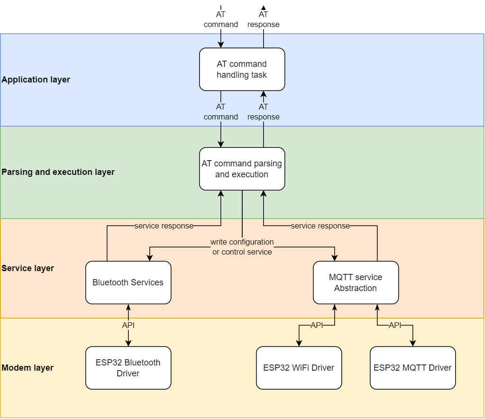

# AT command stack
## Overview
This AT command solution stack provide an easy-to-integrate solution to integrate AT command handling feature into ESP32 firmware. Currently support ESP32-S3
## Architecture explain
### Overview
Refer to following image: 
### Application layer
This layer deal with high lever application stuff.
### Parse and execute layer
This layer deal with parsing AT command and execute AT command functionalities.
### Service layer
This layer is an abstraction of underlying subsystem that AT command try to control. Like MQTT client or Bluetooth.
### Modem layer
The subsystem driver locates here
## Codebase structure explain
- `src/app`: application layer source files:
- `src/common`: common helper functions or macros that use across layers
- `src/port`: contain platform-dependent code
- `src/services`: service layer source files

## Usage
### Compile-time configuration
Configure the stack by using command:
```bash
idf.py menuconfig
```
Go to `Component config/AT command stack configuration` and reconfigure to fit your need

### Only need 2 APIs to integrate
1. During initialization, call `init_at_cmd_app()` to initialize AT command application. 

2. When there is AT command need to handle, call `forward_to_at_cmd_task()`

### Re-define platform-dependent API
Re-define some system-dependent API in `src/port/sys_common_funcs.h`

### Implement handlers for additional handlers
Go to `src/parse_and_exec`. The file `parse_and_exec_cmd_handlers_list.c` lists all supported AT commands and relevant handlers.

What to do? Define new AT commands, define its 4 handlers: Test, Read, Write, Execution. Then extend `supported_at_cmds_parse_exec_handler_list` variable with newly defined AT commands and handlers.

### Should I develop additional service in service layer?
If underlying service is big and complex enough, then you should. For example, during development, managing MQTT client is found to be very complex and developer decide it should have its own service abstraction.